# Projeto New York Taxi

Este README apresenta apenas uma breve descrição do problema bem como a solução implementada.

## Objetivo
Construir um pipeline de engenharia e responder a algumas perguntas realizadas pelo time de negócio.

## Dados
Foi fornecido quatro conjunto de dados em formato `.json` relacionando viagens de táxi na cidade de Nova York nos anos de 2009, 2010, 2011 e 2012, cada ano em um arquivo. Este conjunto é composto de uma série de informações como o preço da viagem, a distância do trajeto, as coordenadas de partida e chegada, o método de pagamento, etc.

## Tecnologias
- Para armazenar os dados, tanto bruto como processado, a ferramenta `S3` foi escolhida;
- Para a construção do pipeline de engenharia de dados foi utilizado o `AWS Glue`;
- A análise foi realizada em um ambiente de jupyter notebook, logo utilizou-se de uma instância no `Sagemaker`;
- A linguagem de programação utilizada foi a `Python`.

## Estrutura do repositório

    ├── README.md                      <- Breve descrição do projeto e ferramentas
    ├── engenharia                     <- Concentra tudo que for relacionado ao pipeline de engenharia de dados
    │   ├── imagens                    <- Concentra prints do pipeline de engenharia de dados
    │   └── scripts                    
    │       ├── raw-to-trusted         <- Script responsável por ler o dado bruto, processar e jogar para a próxima camada (trusted)
    │       └── trusted-to-refined     <- Script responsável por ler o dado processado, aplicar regra de negócio e jogar para a próxima camada (refined)
    └── analise                        <- Concentra tudo que for relacionado a análise de dados
        ├── imagens                    <- Concentra prints das análises
        ├── dados                      <- Arquivo com uma amostra de 50 mil registros
        └── nyctaxy-eda.ipynb          <- Jupyter Notebook com as análises realizadas          
    
## S3
São, ao todo, três camadas:
- **raw**: armazena os dados brutos, da forma como vieram em `.json`. Apenas houve a renomeação dos nomes dos arquivos. Mas a estrutura interna não foi alterada;
- **trusted**: armazena os dados processados e padronizados. Nesta etapa é realizada a renomeação de colunas, ajuste de datas e horas e conversão para tipo `.parquet`. Além disso, nesta camada é feita o join com as informações contidas nos arquivos lookup que estão em `.csv`, além do depara em métodos de pagamento; 
- **refined**: camada onde é aplicada regras de negócios. Neste caso, a regra de negócio foi a seleção apenas das colunas necessárias para responder o problema de negócio e o union dos anos. O arquivo aqui também deve ser um `.parquet`.

Bucket deve ter o nome `dadosfera-dev`, uma pasta `datalake` deve ser criada dentro deste bucket, em seguida deve ser separado as três camadas (`raw`, `trusted` e `refined`).

  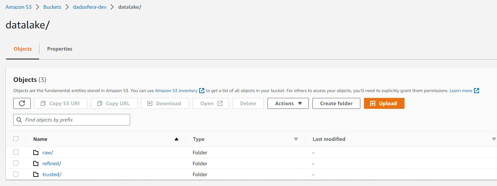

A camada `raw` contém os arquivos `.json` como foram enviados, apenas deve ser feita renomeação deles. O motivo da renomeação foi apenas para padronizar.

  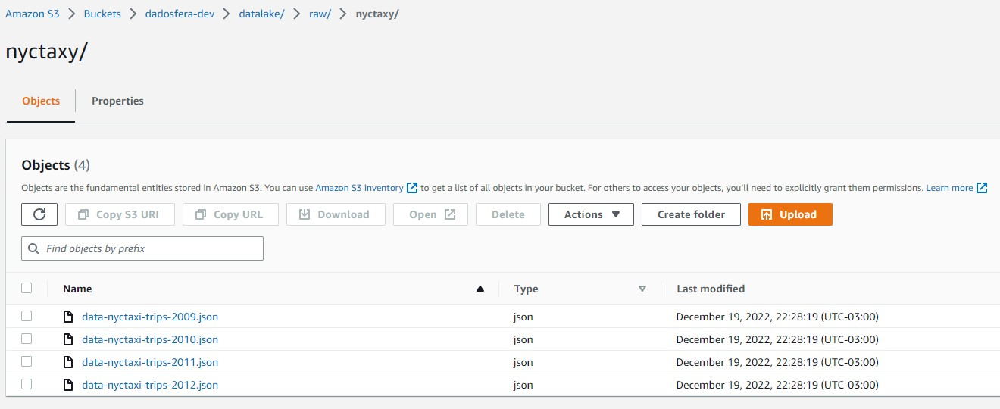

Na camada `raw`, os arquivos `.csv` foram armazenados em um outro caminho, tal como abaixo.

  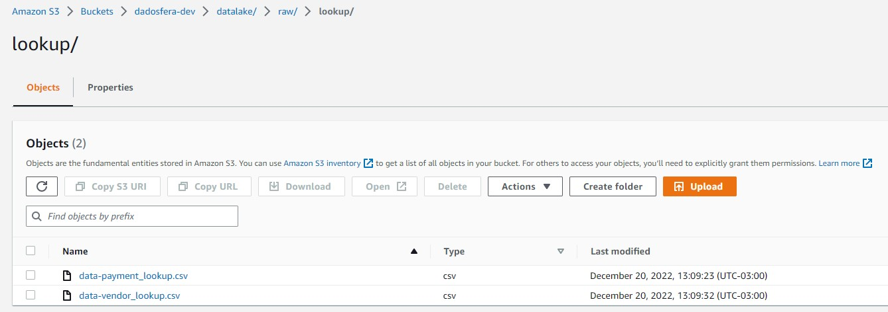

A camada `trusted` já apresenta as correções. Mas nela não foi realizada nenhum filtro de limpeza de dados, para inserir os filtros no pipeline seria necessário reuniões com o time de negócios para entender entender os dados e verificar possíveis existências de regras de negócios. Porém, uma limpeza foi feita no notebook de análise.

  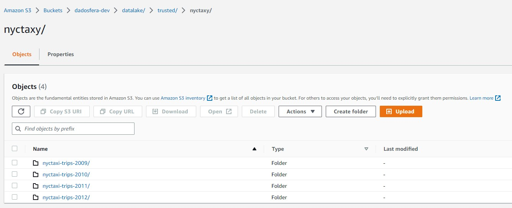

Os arquivos na `trusted` já estão em `.parquet`.

  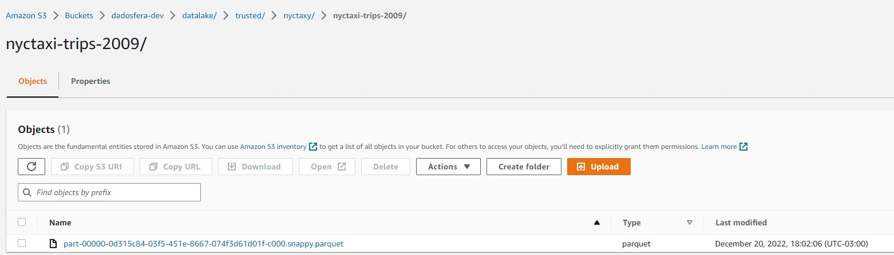

Por fim, a camada `refined`, como dito, já armazena os conjuntos de dados unidos também em `.parquet`.

  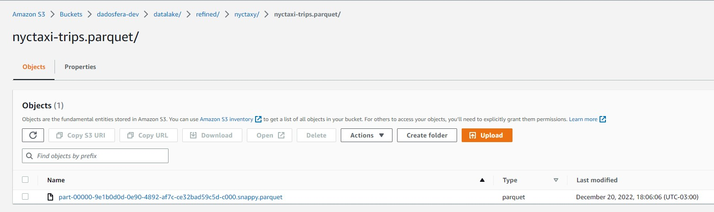

## AWS Glue

Para o Glue, foi construído um workflow simples que processa os dados separadamente até a camada `trusted`, mas o último job fica responsável por unir os arquivos e jogar o resultado na `refined`. O workflow chama-se `dadosfera-nyctaxy-lookup`, possui ao todo 5 jobs e 2 triggers.

  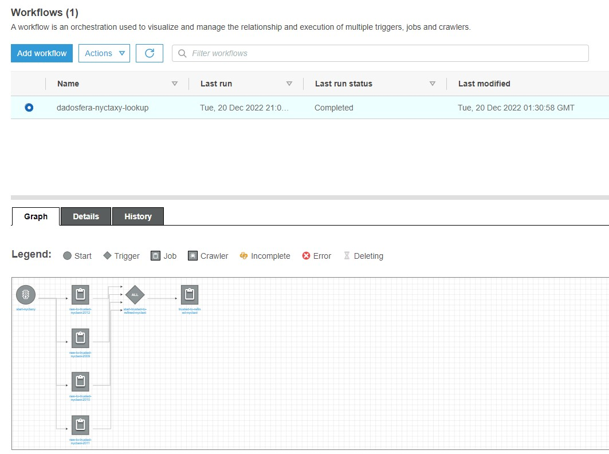

Apresenta-se, nesta lista, os **cinco** jobs citados:
- `raw-to-trusted-nyctaxi-2009`: lê o `.json` de 2009, renomeia as colunas e salva em `.parquet` na `trusted`;
- `raw-to-trusted-nyctaxi-2010`: lê o `.json` de 2010, renomeia as colunas e salva em `.parquet` na `trusted`;
- `raw-to-trusted-nyctaxi-2011`: lê o `.json` de 2011, renomeia as colunas e salva em `.parquet` na `trusted`;
- `raw-to-trusted-nyctaxi-2012`: lê o `.json` de 2012, renomeia as colunas e salva em `.parquet` na `trusted`;
- `trusted-to-refined-nyctaxi`: lê os quatro `.parquet` da trusted, realiza o union e seleciona apenas as colunas que respondem as perguntas do time de negócios.

  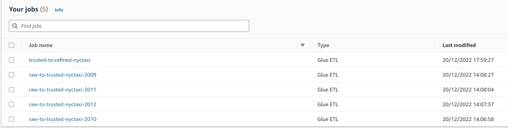

Também os **dois** triggers:
- `start-nyctaxy`: que inicia o workflow;
- `start-trusted-to-refined-nyctaxi`: que inicia o último job `trusted-to-refined-nyctaxi`. Ele deve aguardar os quatro jobs anteriores para disparar.

  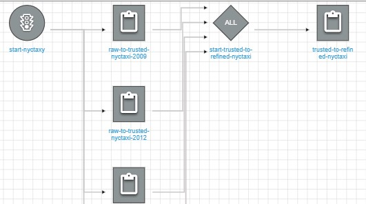

Em relação aos scripts dos jobs, os quatro "raw-to-trusted-nyctaxi" apontam para `s3://aws-glue-assets-613671088431-us-east-1/scripts/raw-to-trusted-nyctaxi.py`, mas eles contêm o parâmetro `--YEAR_FILE` onde é especificado qual ano aquele job vai processar.

  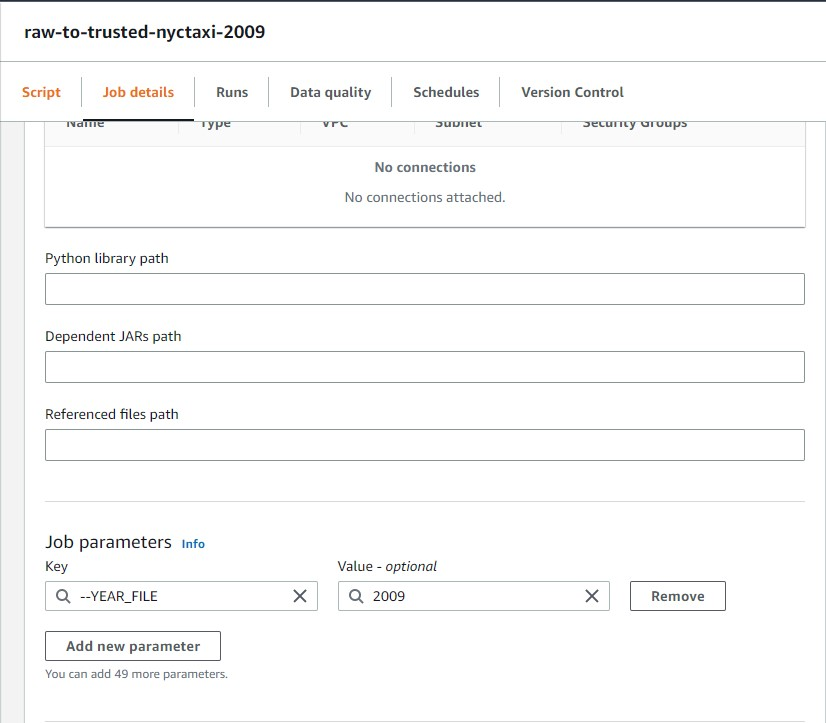

Por outro lado, o job `trusted-to-refined-nyctaxi` aponta apenas para `s3://aws-glue-assets-613671088431-us-east-1/scripts/trusted-to-refined-nyctaxi.py`. Ao final de todo o processo, execute o workflow e espere um resultado semelhante como abaixo:

  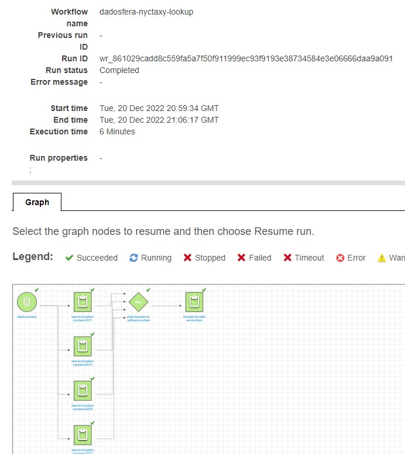

# Análise
Para a análise de dados, foi disponibilizado um notebook dentro da pasta `analise` deste projeto, bem como um relatório em `.pdf`. Para executar o notebook, basta apontar a leitura do dado para o arquivo `nyctaxi-sample.parquet` disponibilizado neste repositório.
